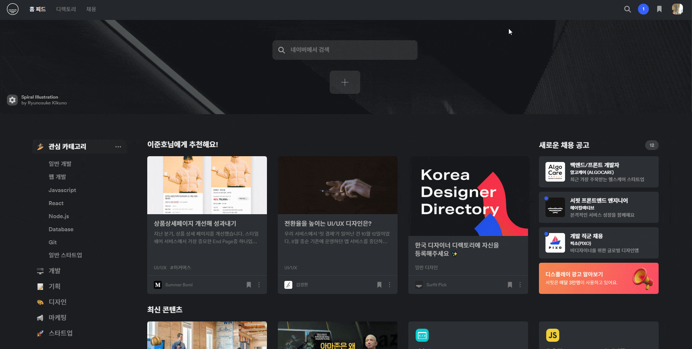

# 안녕하세요. 프론트엔드 개발자 이준호입니다.

 

 

> [포트폴리오 보러가기](https://baegofda.github.io/Portfolio/ "이준호의 포트폴리오")

 

저는

 

꾸준히 성장하며 [깃허브 보러가기](https://github.com/baegofda "이준호의 Github")

 

성장하는것을 기록하고 [블로그 구경가기](https://baegofda.tistory.com/ "이준호의 블로그")

 

성장한 만큼 만들어내는 [PorjectGOC](https://github.com/baegofda/Project-GOC "이준호의 코로나 통계사이트")

 

스터디를 통하여 정보 공유도하는

 

 

항상 노력하고 성장하고 싶은 주니어 개발자입니다.
